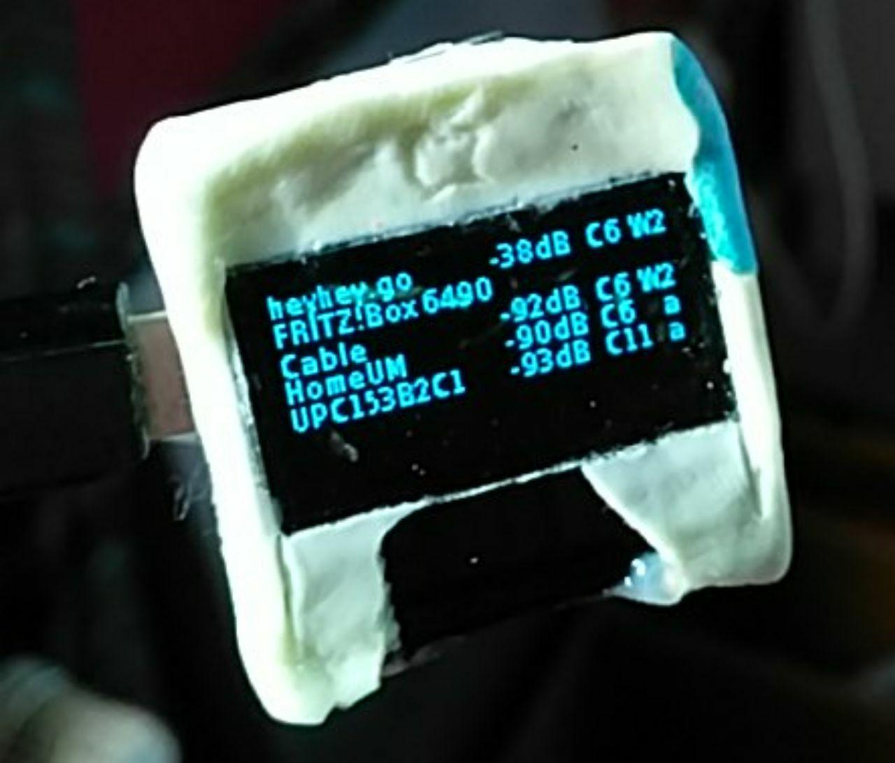

# ESP8266 AP scan SSD1306

Use a ESP8266-12 Wifi module and a 128x64 SPI SSD1306 OLED Display to scan APs.

This Code uses the https://github.com/ThingPulse/esp8266-oled-ssd1306 library.

If there are more then 6 line, it switch to a new page (800ms).
